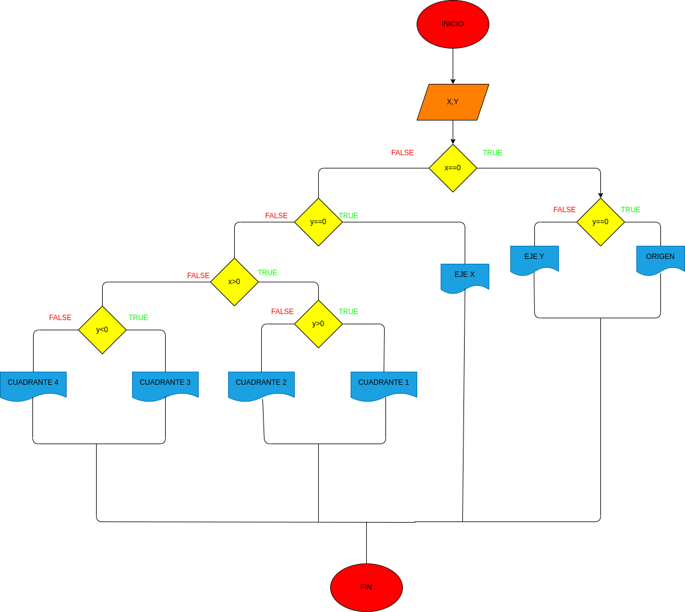

# EJERCICIO 1 TALLER CONDICIONAL

## planos cartesianos (X , Y)
# ANALISIS

variable de entrada(input)

X=un punto del plano

Y=un punto del plano

variables de proceso y salida(processing, storage, output)

RTA=nos dice si la coordenada esta en el origen

RTA=nos dice en que eje se encuentra en el plano 

RTA=nos dice en que cuadrante se encuentra el punto

# DISEÑO

# CONSTRUCCION
