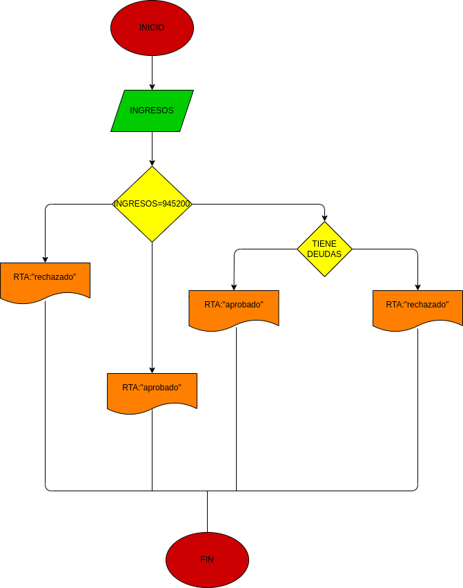

# EJERCICIO NO. 2 prestamo bancaria 

## prestamo bancario

 # ANALISIS

variable de entrada(input)

ingresos del cliente

variables de proceso y salida(processing, storage, output)

RTA=aceptado el prestamo

RTA=rechazado el prestamo

RTA=rechazado el prestamo porque no tiene deudas

# DISEÑO

# CONSTRUCCION