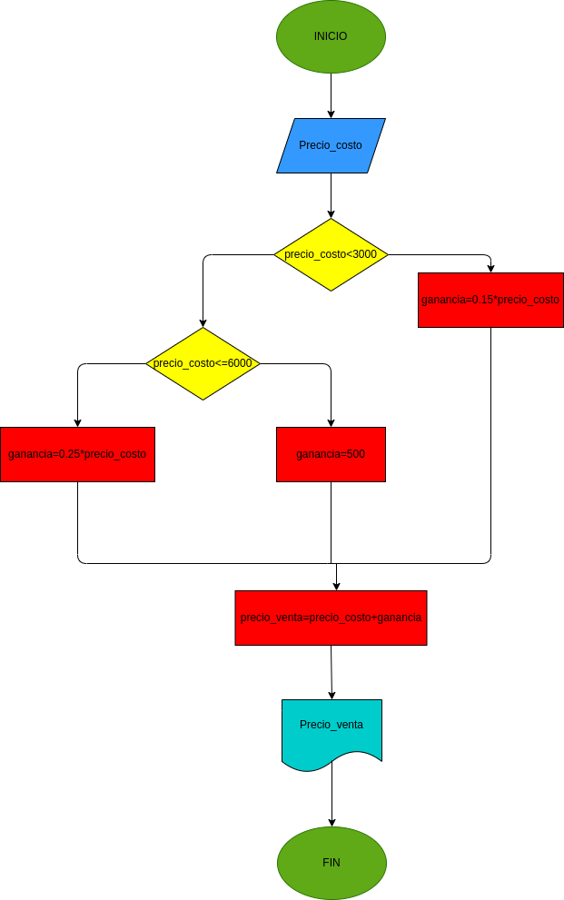

# EJERCICIO NO. 3 ganancia de una papeleria

## ganancia de una papeleria

 # ANALISIS

variable de entrada(input)

ganancias, gastos, costo de la papeleria

variables de proceso y salida(processing, storage, output)

RTA=precio de la venta

RTA=costo del articulo

RTA=ganancias

# DISEÑO

# CONSTRUCCION
